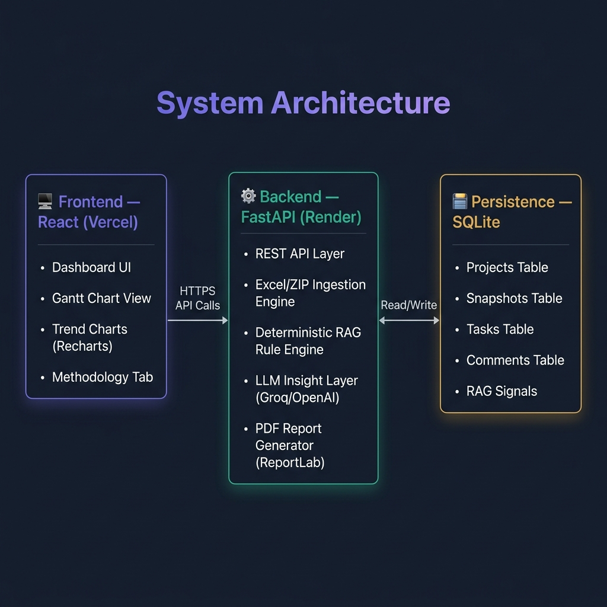
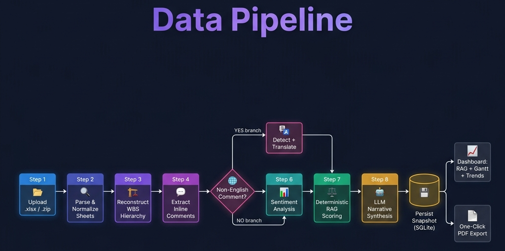

```mermaid
flowchart LR
    A(["📁 Upload\n.xlsx / .zip"]) --> B["🔍 Parse &\nNormalize Sheets"]
    B --> C["🏗️ Reconstruct\nWBS Hierarchy"]
    C --> D["💬 Extract\nInline Comments"]
    D --> E{"🌐 Non-English\nComment?"}
    E -->|Yes| F["🔤 Detect +\nTranslate"]
    E -->|No| G["📊 Sentiment\nAnalysis"]
    F --> G
    G --> H["⚖️ Deterministic\nRAG Scoring"]
    H --> I["🤖 LLM Narrative\nSynthesis"]
    I --> J[("💾 SQLite\nSnapshot")]
    J --> K["📈 Dashboard:\nRAG + Gantt + Trends"]
    J --> L["📄 PDF\nExport"]

    style A fill:#4f46e5,color:#fff,stroke:#4f46e5
    style B fill:#7c3aed,color:#fff,stroke:#7c3aed
    style C fill:#7c3aed,color:#fff,stroke:#7c3aed
    style D fill:#9333ea,color:#fff,stroke:#9333ea
    style E fill:#ec4899,color:#fff,stroke:#ec4899
    style F fill:#f59e0b,color:#fff,stroke:#f59e0b
    style G fill:#0891b2,color:#fff,stroke:#0891b2
    style H fill:#059669,color:#fff,stroke:#059669
    style I fill:#d97706,color:#fff,stroke:#d97706
    style J fill:#1e40af,color:#fff,stroke:#1e40af
    style K fill:#16a34a,color:#fff,stroke:#16a34a
    style L fill:#dc2626,color:#fff,stroke:#dc2626
```

<!-- ═══════════════════════════════════════════════════════════════════ -->
<!--                        ANIMATED HEADER                            -->
<!-- ═══════════════════════════════════════════════════════════════════ -->

<div align="center">

  

</div>

<!-- ═══════════════════════════════════════════════════════════════════ -->
<!--                        TYPING ANIMATION                           -->
<!-- ═══════════════════════════════════════════════════════════════════ -->

<div align="center">

[](https://git.io/typing-svg)

</div>

---

<!-- ═══════════════════════════════════════════════════════════════════ -->
<!--                           BADGES                                  -->
<!-- ═══════════════════════════════════════════════════════════════════ -->

<div align="center">

[](https://www.python.org/)&nbsp;
[](https://fastapi.tiangolo.com/)&nbsp;
[](https://react.dev/)&nbsp;
[](https://sqlite.org/)&nbsp;
[](https://nodejs.org/)

[](https://projectpulse-ai-project-health-reporting.onrender.com)&nbsp;
[](https://project-pulse-ai-project-health-rep.vercel.app/)&nbsp;
[](./LICENSE)&nbsp;
[](https://github.com/Vibhakash/ProjectPulse-AI-Project-health-reporting-agent-with-RAG-status-system/pulls)

</div>

---

<!-- ═══════════════════════════════════════════════════════════════════ -->
<!--                         TECH ICONS                                -->
<!-- ═══════════════════════════════════════════════════════════════════ -->

<div align="center">

### 🛠️ Built With


</div>

---

<!-- ═══════════════════════════════════════════════════════════════════ -->
<!--                          DESCRIPTION                              -->
<!-- ═══════════════════════════════════════════════════════════════════ -->

<div align="center">

<table>
<tr>
<td align="center" width="100%">

> 🧠 **ProjectPulse AI** is an intelligent project-health reporting agent that parses messy multi-sheet Excel schedules, computes a **deterministic RAG score**, layers **LLM-derived stakeholder sentiment** and narrative summaries on top, and presents everything in a **modern React dashboard** with historical trends, interactive Gantt charts, and one-click PDF exports.

</td>
</tr>
</table>

</div>

---

<!-- ═══════════════════════════════════════════════════════════════════ -->
<!--                       TABLE OF CONTENTS                           -->
<!-- ═══════════════════════════════════════════════════════════════════ -->

<details open>
<summary><h2>📑 Table of Contents</h2></summary>

| # | Section |
|:---:|---|
| 1 | [🎯 The Problem & Solution](#-the-problem--solution) |
| 2 | [✨ Core Features](#-core-features) |
| 3 | [🏗️ System Architecture](#%EF%B8%8F-system-architecture) |
| 4 | [🔄 Data Pipeline](#-data-pipeline) |
| 5 | [🛠️ Full Tech Stack](#%EF%B8%8F-full-tech-stack) |
| 6 | [🎬 Demo & Live Links](#-demo--live-links) |
| 7 | [📦 Deliverables Map](#-deliverables-map) |
| 8 | [⚙️ Local Setup](#%EF%B8%8F-local-setup) |
| 9 | [🚀 Deployment](#-deployment) |
| 10 | [🧩 Design Decisions](#-design-decisions) |
| 11 | [📄 License & Author](#-license--author) |

</details>

---

<!-- ═══════════════════════════════════════════════════════════════════ -->
<!--                    THE PROBLEM & SOLUTION                         -->
<!-- ═══════════════════════════════════════════════════════════════════ -->

## 🎯 The Problem & Solution

<table>
<tr>
<td width="50%" valign="top">

### ❌ The Problem

Traditional project status reporting is:

- 🤷 **Manual & Subjective** — health calls depend on whoever made the spreadsheet
- 🔒 **Untraceablе** — no way to see *why* a project is Red, Amber, or Green
- 🙈 **Sentiment Blind** — stakeholder comments buried in free-text cells go unread
- 🐌 **Delayed** — by the time an executive summary is ready, it's outdated

</td>
<td width="50%" valign="top">

### ✅ The Solution

ProjectPulse AI splits **scoring** and **storytelling** into two jobs:

- ⚖️ A **deterministic rule engine** computes an *auditable* RAG score from measurable signals
- 🤖 An **LLM layer** transforms the evidence into an executive-ready narrative
- 📈 **Historical snapshots** track every project's health trajectory over time
- 🔎 Every score traces back to a **source row** — nothing is a black box

</td>
</tr>
</table>

---

<!-- ═══════════════════════════════════════════════════════════════════ -->
<!--                        CORE FEATURES                              -->
<!-- ═══════════════════════════════════════════════════════════════════ -->

## ✨ Core Features

<div align="center">

<table>
<tr>
<td align="center" width="33%">

### 🎯
**Dynamic RAG Engine**

Deterministic rule engine computing schedule health, unmitigated risks, and milestone slips into an auditable RAG score

</td>
<td align="center" width="33%">

### 🤖
**AI Agent Insights**

LLM-powered Key Drivers, Top Risks, and Recommendations grounded in real signal evidence

</td>
<td align="center" width="33%">

### 📈
**Historical Trends**

Groups snapshots over time and visualizes RAG trajectory via an interactive Recharts line graph

</td>
</tr>
<tr>
<td align="center">

### 📊
**Interactive Gantt Charts**

Visual task timeline highlighting baseline drift and schedule slippage — built into the dashboard

</td>
<td align="center">

### 🌐
**Multi-Language Sentiment**

Detects, translates, and incorporates non-English stakeholder comments (e.g., French) into AI summaries

</td>
<td align="center">

### 📄
**Premium PDF Exports**

One-click, polished offline executive reports built with ReportLab matching the dashboard aesthetic

</td>
</tr>
<tr>
<td align="center">

### 🗂️
**Bulk ZIP Ingestion**

Drop `.zip` archives with multiple weeks of data — processed entirely in-memory, no file-lock issues

</td>
<td align="center">

### 🔔
**RAG Flip Email Alerts**

Automatic email notifications when a project's status worsens (Green → Amber, Amber → Red, etc.)

</td>
<td align="center">

### 📊
**Monthly PPTX Synthesis**

Auto-generates a 6-slide executive PowerPoint deck from all project snapshots in the database

</td>
</tr>
</table>

</div>

---

<!-- ═══════════════════════════════════════════════════════════════════ -->
<!--                      SYSTEM ARCHITECTURE                          -->
<!-- ═══════════════════════════════════════════════════════════════════ -->

## 🏗️ System Architecture

<div align="center">



</div>

<br/>

<div align="center">

| Layer | Technology | Role |
|:---:|:---:|---|
| 🖥️ **Frontend** | React + Vite + TanStack Router | Dashboard UI, Gantt, Trends, Uploads |
| ⚙️ **Backend** | FastAPI + Python | REST API, RAG Engine, LLM, PDF Generator |
| 🗄️ **Database** | SQLite | Projects, Snapshots, Tasks, Comments, Signals |
| 🤖 **AI Layer** | Groq / OpenAI LLM | Narrative generation, sentiment, risk themes |
| 📄 **Reporting** | ReportLab + python-pptx | PDF exports + PowerPoint decks |

</div>

---

<!-- ═══════════════════════════════════════════════════════════════════ -->
<!--                        DATA PIPELINE                              -->
<!-- ═══════════════════════════════════════════════════════════════════ -->

## 🔄 Data Pipeline

<div align="center">



</div>

<br/>

<div align="center">



</div>

---

<!-- ═══════════════════════════════════════════════════════════════════ -->
<!--                         TECH STACK                                -->
<!-- ═══════════════════════════════════════════════════════════════════ -->

## 🛠️ Full Tech Stack

<div align="center">

<table>
<thead>
<tr>
<th>Layer</th>
<th>Technology</th>
<th>Purpose</th>
</tr>
</thead>
<tbody>
<tr>
<td><b>🐍 Backend Language</b></td>
<td></td>
<td>Core agent logic, ingestion, RAG engine</td>
</tr>
<tr>
<td><b>⚡ API Framework</b></td>
<td></td>
<td>REST API serving the React frontend</td>
</tr>
<tr>
<td><b>⚛️ Frontend</b></td>
<td> </td>
<td>Dashboard, charts, file uploads</td>
</tr>
<tr>
<td><b>🗄️ Database</b></td>
<td></td>
<td>Portable, auditable snapshot store</td>
</tr>
<tr>
<td><b>📊 Visualization</b></td>
<td></td>
<td>RAG trend lines, Gantt bars, Pie charts</td>
</tr>
<tr>
<td><b>🤖 AI / LLM</b></td>
<td> / </td>
<td>Narrative synthesis, sentiment, risk themes</td>
</tr>
<tr>
<td><b>📄 PDF Engine</b></td>
<td></td>
<td>Premium styled executive PDF reports</td>
</tr>
<tr>
<td><b>📊 Presentation</b></td>
<td></td>
<td>Monthly executive PowerPoint deck generation</td>
</tr>
<tr>
<td><b>📦 Excel Ingestion</b></td>
<td></td>
<td>Multi-sheet messy Excel parser</td>
</tr>
<tr>
<td><b>🚀 Deployment</b></td>
<td> </td>
<td>Backend on Render, Frontend on Vercel</td>
</tr>
</tbody>
</table>

</div>

---

<!-- ═══════════════════════════════════════════════════════════════════ -->
<!--                      DEMO & LIVE LINKS                            -->
<!-- ═══════════════════════════════════════════════════════════════════ -->

## 🎬 Demo & Live Links

<div align="center">

| 🌐 Service | 🔗 Live URL | Status |
|:---:|---|:---:|
| **Frontend Dashboard** | [project-pulse-ai-project-health-rep.vercel.app](https://project-pulse-ai-project-health-rep.vercel.app/) |  |
| **Backend API** | [projectpulse-ai-project-health-reporting.onrender.com](https://projectpulse-ai-project-health-reporting.onrender.com) |  |
| **API Docs (Swagger)** | [.../docs](https://projectpulse-ai-project-health-reporting.onrender.com/docs) |  |

<br/>

<a href="https://project-pulse-ai-project-health-rep.vercel.app/">
  
</a>

> 📲 **Scan the QR code** above to instantly open the live dashboard on any device!

</div>

> 🎥 **Demo Video** — `Zycus-ProjectPulse AI-by Vibha Kashyap.mp4` is available locally (~172 MB, not committed to Git due to size). Share separately or host via Git LFS / YouTube.

---

<!-- ═══════════════════════════════════════════════════════════════════ -->
<!--                       DELIVERABLES MAP                            -->
<!-- ═══════════════════════════════════════════════════════════════════ -->

## 📦 Deliverables Map

<div align="center">

| # | 📋 Deliverable | 📁 Location |
|:---:|---|---|
| 1 | 🏷️ Features & Tech Stack | [`Features and techstack.md`](./Features%20and%20techstack.md) |
| 2 | 📖 One-Page RAG Methodology | [`backend/docs/rag_methodology.md`](./backend/docs/rag_methodology.md) — also browsable in-app |
| 3 | 🤖 Working AI Agent | See [Local Setup](#%EF%B8%8F-local-setup) below |
| 4 | 🧪 Test Data Generator | Run `python generate_test_data.py` → produces `Test_Suite.zip` |
| 5 | 📊 Monthly Presentation (6 slides, 16:9) | [`backend/outputs/monthly/monthly_project_health.pptx`](./backend/outputs/monthly/monthly_project_health.pptx) |

</div>

---

<!-- ═══════════════════════════════════════════════════════════════════ -->
<!--                         LOCAL SETUP                               -->
<!-- ═══════════════════════════════════════════════════════════════════ -->

## ⚙️ Local Setup

### Prerequisites

&nbsp;
&nbsp;


### 🐍 Backend Setup

```bash
cd backend
python -m venv .venv
.venv\Scripts\activate          # Windows
# source .venv/bin/activate    # macOS / Linux
pip install -r requirements.txt
pip install -e .
```

### ⚛️ Frontend Setup

```bash
cd frontend
npm install
```

### 🔐 Environment Variables

Create a `.env` file in the `backend/` directory:

```env
# LLM Provider (choose one)
GROQ_API_KEY=your_groq_api_key_here
# OPENAI_API_KEY=your_openai_api_key_here

# Optional: Email Alerts
ALERT_SMTP_HOST=smtp.gmail.com
ALERT_SMTP_PORT=587
ALERT_SMTP_USER=your_email@gmail.com
ALERT_SMTP_PASS=your_app_password
ALERT_EMAIL_TO=recipient@example.com
```

### ▶️ Running Locally

| Terminal | Command | URL |
|:---:|---|:---:|
| **1 — Backend** | `cd backend && .venv\Scripts\python run_api.py` | [localhost:8001](http://localhost:8001) |
| **2 — Frontend** | `cd frontend && npm run dev` | [localhost:3000](http://localhost:3000) |

> Open **[http://localhost:3000](http://localhost:3000)** to view the dashboard 🎉

---

<!-- ═══════════════════════════════════════════════════════════════════ -->
<!--                          DEPLOYMENT                               -->
<!-- ═══════════════════════════════════════════════════════════════════ -->

## 🚀 Deployment

<div align="center">

| Layer | Platform | Live URL |
|:---:|:---:|---|
| ⚙️ **Backend — FastAPI** | [](https://projectpulse-ai-project-health-reporting.onrender.com) | 🔗 [projectpulse-ai-project-health-reporting.onrender.com](https://projectpulse-ai-project-health-reporting.onrender.com) |
| 🌐 **Frontend — React** | [](https://project-pulse-ai-project-health-rep.vercel.app/) | 🔗 [project-pulse-ai-project-health-rep.vercel.app](https://project-pulse-ai-project-health-rep.vercel.app/) |

</div>

<details>
<summary><b>📋 Render (Backend) Configuration</b></summary>
<br/>

| Field | Value |
|---|---|
| **Root Directory** | `backend` |
| **Build Command** | `pip install -r requirements.txt && pip install -e .` |
| **Start Command** | `uvicorn src.project_health.api:app --host 0.0.0.0 --port $PORT` |
| **Health Check Path** | `/api/health` |
| **Disk Mount Path** | `storage` _(for SQLite persistence)_ |
| **Env Var** | `GROQ_API_KEY` or `OPENAI_API_KEY` |

</details>

<details>
<summary><b>📋 Vercel (Frontend) Configuration</b></summary>
<br/>

| Field | Value |
|---|---|
| **Root Directory** | `frontend` |
| **Framework Preset** | `Vite` |
| **Build Command** | `npm run build` _(auto-detected)_ |
| **Output Directory** | `dist` _(auto-detected)_ |
| **Env Var** | `VITE_API_BASE_URL` = `https://projectpulse-ai-project-health-reporting.onrender.com/api` |

</details>

---

<!-- ═══════════════════════════════════════════════════════════════════ -->
<!--                      DESIGN DECISIONS                             -->
<!-- ═══════════════════════════════════════════════════════════════════ -->

## 🧩 Design Decisions

<details>
<summary><b>⚖️ 1. Deterministic RAG First, LLM Second</b></summary>
<br/>

The final **Red, Amber, or Green** status is calculated by a deterministic weighted rule engine in `backend/src/project_health/rag_engine.py`, _not_ by asking an LLM to infer project health directly from spreadsheets.

This is intentional: executive status reporting needs **traceability**. The scoring model uses inspectable signals — schedule health, progress gap, milestone health, blockers, stakeholder sentiment, and budget availability. The LLM layer is used only **after** these signals are computed, turning the evidence into executive summaries, risk themes, and next-step recommendations.

</details>

<details>
<summary><b>🔍 2. Evidence-Based, Auditable Reporting</b></summary>
<br/>

The system preserves source row numbers, parsed task details, inline task comments, warnings, and signal-level reasoning — making each RAG decision **auditable** instead of a black-box summary.

SQLite is the persistence layer because it's lightweight, portable, and easy for reviewers to inspect. It stores project snapshots, tasks, comments, RAG signals, and data quality issues, so weekly reports and monthly synthesis can be regenerated from the same evidence base.

</details>

<details>
<summary><b>📁 3. Resilient Excel Ingestion & Smart Grouping</b></summary>
<br/>

The Excel parser is built for **messy real-world project-plan exports**: it detects useful sheets and columns from workbook content, normalizes inconsistent field names, handles missing or malformed values, reconstructs WBS hierarchy from level/ancestor fields, and explicitly extracts inline comments from task rows.

The database schema (`UNIQUE(name)`) intentionally groups uploads by their internal **Project Name** rather than filename — letting the system merge `Week1.xlsx`, `Week2.xlsx`, and `Week3.xlsx` into one unified chronological timeline for **trend tracking**.

</details>

<details>
<summary><b>🔀 4. Frontend & Backend Separation</b></summary>
<br/>

The backend owns ingestion, scoring, persistence, report generation, and synthesis via FastAPI. The React frontend focuses on uploading project plans, browsing portfolio health, rendering interactive Gantt and Trend charts, and navigating generated insights.

This split keeps the analytical logic reusable across **CLI, API, scheduler, or dashboard** workflows.

</details>

---

<!-- ═══════════════════════════════════════════════════════════════════ -->
<!--                      LICENSE & AUTHOR                             -->
<!-- ═══════════════════════════════════════════════════════════════════ -->

## 📄 License & Author

<div align="center">

<table>
<tr>
<td align="center" width="50%">

### 📄 License

This project is licensed under the **[MIT License](./LICENSE)**

```
MIT License — Copyright (c) 2026 Vibha Kashyap

Free to use, modify, distribute, and sell
with attribution to the original author.
```

[](./LICENSE)

</td>
<td align="center" width="50%">

### 👩‍💻 Author

**Vibha Kashyap**

B.Tech AIML Student

[](https://github.com/Vibhakash)

_Built with ❤️ and a lot of ☕_

</td>
</tr>
</table>

</div>

---

<!-- ═══════════════════════════════════════════════════════════════════ -->
<!--                          FOOTER                                   -->
<!-- ═══════════════════════════════════════════════════════════════════ -->

<div align="center">

### ⭐ If this project helped you, consider giving it a star!

[](https://github.com/Vibhakash/ProjectPulse-AI-Project-health-reporting-agent-with-RAG-status-system)

<br/>

_✨ Because project status shouldn't be a guessing game — deterministic where it matters, intelligent where it helps. ✨_

</div>


